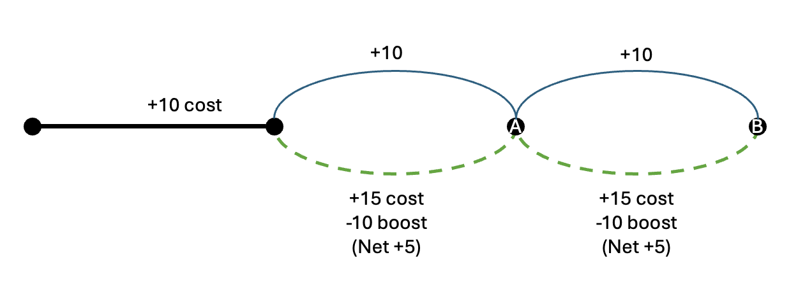

# Optimization Folder

# Code
This folder contains

* **Data preparation:** Code to extract and prepare data for the optimization model. Note that as of 08/24 we have not identified appropriate data to estimate the model. Ideally, we would find data on the usage of individual charging stations, including *where users are coming from*. We have not yet identified such data.
    * `advan_data_for_optimization.py` downloads Point of Interest (POI) data from Advan, in order to check whether it is appropriate for our needs. (Note: it is not)
    * `numerator_data` and `numerator_data_charging`: Extracts data from the Numerator dataset to determine whether it is suitable for our needs (it is not). 
* **Experiments with different route-finding algorithms and objective functions**
    * `corner_solutions.py`: A very simple script that shows how using a linear objective function leads to corner solutions (i.e., users choose to charge on every link they pass through, or choose to never charge - rather than choosing to sometimes charge, and sometimes not charge). 
    * 

## corner_solutions.py
This code is demonstrative only. 

The setting is the following:
* We have a directed graph with links through it
* Each link has a distance cost associated with it
* In addition, the user faces a constraint (i.e., representing the limited range of their EV)
* Finally, *some* of the links provide a *boost* that *slackens the constraint* (this represents the benefits of EV charging: when you charge, you can then drive further).

We imagine the following road network:
* First, the user must traverse Link 1
* Then the user must make a choice, between Link 2 or Link 3. They both arrive at the same point
* Then the user must make a final choice between Link 4, and Link 5. They both arrive at the same point. 

Thus, the road network looks something like this image. In the image, we have the following costs and boosts:

* Link 1: Cost 10
* Link 2: Cost 10, no boost (this is a "road link")
* Link 3: Cost 15, boost of 10 (this is a "charging link" - it takes longer time (represented by the higher cost), but comes with a boost)
* Link 4: Cost 10, no boost
* Link 5: Cost 15, boost of 10 (this is a charging link)

The objective function is either linear or non-linear. In the linear case, the cost at the end of the trip is:
$\alpha_1(\text{Total cost}) - \alpha_2(\text{Remaining constraint})$

In the non-linear case, the cost at the end of the trip is:
$\alpha_1(\text{Total cost}) - \alpha_2(\sqrt{\text{Remaining constraint}})$

This code shows how the user would choose an optimal route, for different values of $\alpha_1$ and $\alpha_2$, and for a nonlinear or linear objective function.

**Result:** The code shows that when we use a linear cost function, we end up with all corner solutions (i.e., the user chooses to charge on both occasions, or they choose to never charge). 

**Implication:** We likely need to include some non-linearity in our objective function. 

## network.py

