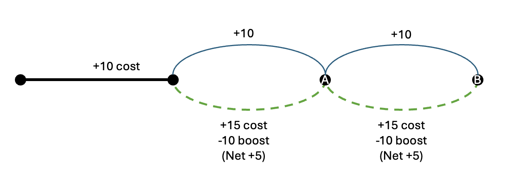
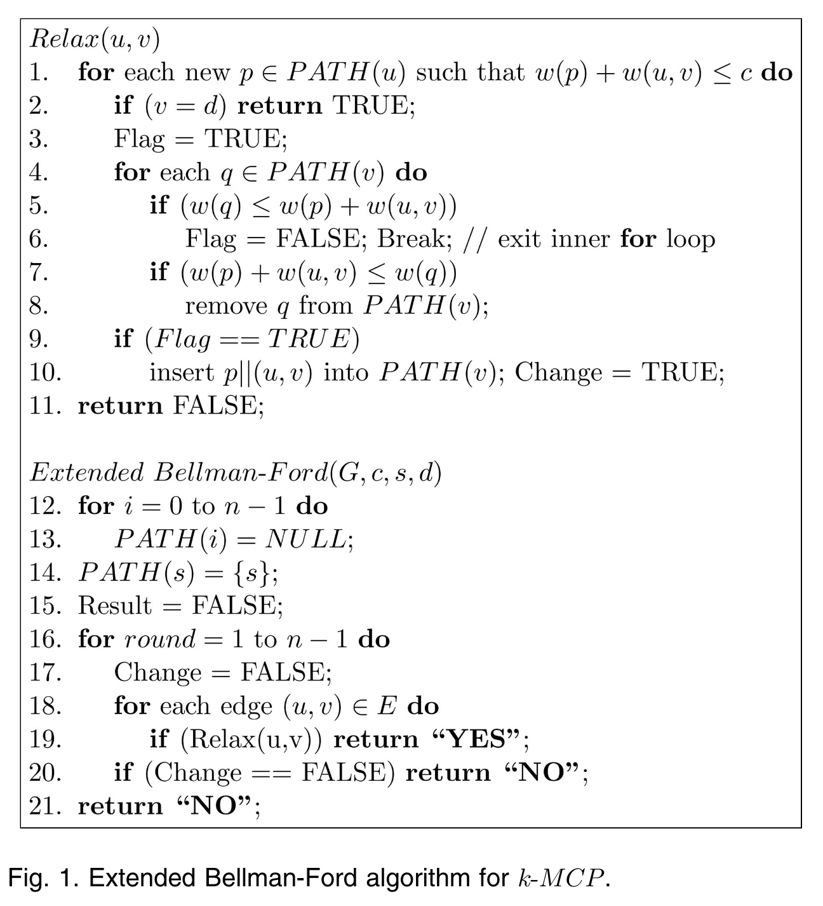

# Optimization Folder

# Code
This folder contains

* **Data preparation:** Code to extract and prepare data for the optimization model. Note that as of 08/24 we have not identified appropriate data to estimate the model. Ideally, we would find data on the usage of individual charging stations, including *where users are coming from*. We have not yet identified such data.
    * `advan_data_for_optimization.py` downloads Point of Interest (POI) data from Advan, in order to check whether it is appropriate for our needs. (Note: it is not)
    * `numerator_data` and `numerator_data_charging`: Extracts data from the Numerator dataset to determine whether it is suitable for our needs (it is not). 
* **Experiments with different route-finding algorithms and objective functions**
    * `corner_solutions.py`: A very simple script that shows how using a linear objective function leads to corner solutions (i.e., users choose to charge on every link they pass through, or choose to never charge - rather than choosing to sometimes charge, and sometimes not charge). 
    * 

## corner_solutions.py
This code is demonstrative only. 

The setting is the following:
* We have a directed graph with links through it
* Each link has a distance cost associated with it
* In addition, the user faces a constraint (i.e., representing the limited range of their EV)
* Finally, *some* of the links provide a *boost* that *slackens the constraint* (this represents the benefits of EV charging: when you charge, you can then drive further).

We imagine the following road network:
* First, the user must traverse Link 1
* Then the user must make a choice, between Link 2 or Link 3. They both arrive at the same point
* Then the user must make a final choice between Link 4, and Link 5. They both arrive at the same point. 

Thus, the road network looks something like this image. In the image, we have the following costs and boosts:

* Link 1: Cost 10
* Link 2: Cost 10, no boost (this is a "road link")
* Link 3: Cost 15, boost of 10 (this is a "charging link" - it takes longer time (represented by the higher cost), but comes with a boost)
* Link 4: Cost 10, no boost
* Link 5: Cost 15, boost of 10 (this is a charging link)

The objective function is either linear or non-linear. In the linear case, the cost at the end of the trip is:
$\alpha_1(\text{Total cost}) - \alpha_2(\text{Remaining constraint})$

In the non-linear case, the cost at the end of the trip is:
$\alpha_1(\text{Total cost}) - \alpha_2(\sqrt{\text{Remaining constraint}})$

This code shows how the user would choose an optimal route, for different values of $\alpha_1$ and $\alpha_2$, and for a nonlinear or linear objective function.

**Result:** The code shows that when we use a linear cost function, we end up with all corner solutions (i.e., the user chooses to charge on both occasions, or they choose to never charge). 

**Implication:** We likely need to include some non-linearity in our objective function. 

## bf_extended.py and path.py

**Inputs** This file relies on the `Path` object defined in `path.py`. 

**Other files**: This algorithm is used in `network.py` and `test_bf_extended.py`. 

This file provides an implementation of the Extended Bellman-Ford algorithm reviewed in:
* Meongchul Song and Sahni, S. (2006) ‘Approximation algorithms for multiconstrained quality-of-service routing’,
        IEEE Transactions on Computers, 55(5), pp. 603–617. Available at: https://doi.org/10.1109/TC.2006.67.
* Garroppo, R.G., Giordano, S. and Tavanti, L. (2010) ‘A survey on multi-constrained optimal path computation: 
        Exact and approximate algorithms’, Computer Networks, 54(17), pp. 3081–3107. Available at: https://doi.org/10.1016/j.comnet.2010.05.017.

Why an Extended Bellman-Ford algorithm? The key idea here is that while the more commonly used Dijkstra's algorithm is able to identify the shortest path through a Graph, it faces two main limitations:
* As-is, it is only designed to work with a *single weight metric* on each link. That is, each link is associated with a single weight, and the goal is to minimize the sum of those link weights over the course of a path.
* Dijkstra's algorithm *cannot work with negative weights*. 

These two limitations are important for our project. In our model, we seek to represent EV charging by:
* Having two weights per edge: a time cost (that we seek to minimize), and a distance cost (that is constrained - we cannot exceed the maxmimum distance)
* Having some negative weights: In particular, going through an EV charging station is a negative distance cost
* Having a constraint: In particular, the EV driver cannot exceed the range of their vehicle. They must either charge (for a negative distance cost, but an extra time cost), or they cannot complete the route.

The Extended Belman-Ford algorithm in `bf_extended` seeks to achieve this. A key limitation of this approach is that it appears to be quite slow, as shown in `test_bf_extended.py`. However, it does appear to successfully solve the K-Multiple Constrained Paths problem. 

**Important note:** As implemented, the algorithm here seeks to *minimize the time taken to get from $i$ to $j$* while remaining within a distance constraint. Suppose we have two paths:
* Path A takes 40 minutes, and 40km, which is within the constraint
* Path B takes 50 minutes, and 20km, which is within the constraint (the driver taking Path B chooses to charge - it takes them 10 minutes extra to do this, but they get back 20km of range)

Then we *automatically choose Path B*. This is **not the optimization** we wish to do, where drivers trade off between the time taken, and the range remaining at the end. 

### Idea behind the Extended Bellman-Ford Algorithm
Song and Sahni provide the following psuedo-code for the Extended Bellman-Ford algorithm.

This is implemented (somewhat imperfectly) in `bf_extended` using `path.py` to implement Path objects. A few notes:
* As written, each edge has two weights, a distance weight (the first weight), and a time weight (the second weight).
* The idea is to *minimize one weight* whilst remaining within a constraint for the other weight. This explains the line: `g = GraphExtended(8, 2, np.array([np.infty, 47]))` The idea here is that we are initializing a graph with eight vertices, and two weights on each link between vertices. Our goal is to minimize the sum of the first weights, whilst remaining within a constraint of 47 for the second weights (e.g., get to your destination in the quickest time possible, whilst keeping your total distance under 47km). 
* When comparing paths to a given node, there are a few cases:
    * Case 0: They are the same path. In that case, we do not add the path.
    * Case 1/2: One of the paths has a lower value for the metric to be minimized (in the above example, that's the first metric, for which the constraint is `np.inft`). In this case we keep only the path with a lower value for that metric.
    * Case 3a: The paths are equal for all metrics. Then we keep both paths.
    * Case 3b: The paths are equal on the main metric to be minimzed, but differ in the other metrics (i.e., they are the same at index 0 of the weight vector, but differ in indices $i>0$ of the weight vector)
        * If the old path is better for all the other metrics, then we don't add the new path, we just keep the old one
        * If the new path is better for all the other metrics, then we add the new path and drop the old
        * If the old path is sometimes better, sometimes worse, then we add the new path while keeping the old. 
* Paths are implemented in `path.py`. A few notes about this:
    * In this implementation, we simply sum up the weights. I.e., we are using a linear cost function, where the cost of a route, is simply the sum of the costs of individual segments. Simply $\text{Cost} = (c_0, c_1) = (\sum_{l \in r} c_0, \sum_{l\in r} c_1)$ where the sums are taken over all the links in a route.
    * At this point, we had not considered a non-linear objective function. 

## network.py and test_bf_extended.py
`network.py` is a utility script that seeks to create new test cases for the BF-Extended algorithm. 
`test_bf_extended.py` seeks to test the Extended Bellman Ford Algorithm in terms of time taken, and how this changes with input size. 

**network.py**

We implement two object classes:

`AdjWeightGenerator`: used to generate adjacency and weight matrices on which to test the BF-Extended algorithm. Instances have a `size` attribute. This is the number of nodes in a single row or column. Thus, the total number of nodes will be `self.size ** 2`. The following methods are implemented:
* `generate_adjacency(connection_probability)`
    * Generates an adjacency matrix $(\text{size}^2 \times \text{size}^2)$ That is, if the generator has a size of 10, there are 100 nodes, and the adjacency matrix will be $100\times 100$. Nodes are arranged in a square, the only valid links are between nodes that are vertical or horizontal neighbours (i.e., no diagonal links). Furthermore, there are no self-loops. Nodes are connected with probabilit `connection_probability`. Otherwise, they are not connected. The lack of connections between certain nodes is designed to test the BF-Algorithm.
* `generate_weights(charging = False, charging_probability = 0.3)`. 
    * Generates a weight matrix for the graph. If `charging` is disabled, then every single weight is 1. Thus, the shortest path will simply be the path that takes the fewest steps.
    * If `charging` is enabled, then the weight will -1 with probability `charging_probability`, and 1 with the inverse. A -1 weight indicates a charging link (i.e., we randomly sprinkle in charging links to our network)
* `load_graph(constraint)`
    * Loads a `GraphExtended` instance from `bf_extended.py` with the given constraint. 

`RoadNetwork`: Used to display the adjacency matrix generated above as a square road network.
* 

