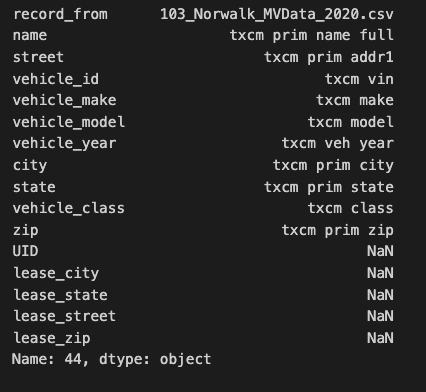

# Municipal Data
This folder contains code that was used to perform some data cleaning / preparation on the municipal car registration dataset compiled by Ken Gillingham's team at YSE. The municipal dataset was compiled from the individual tax records of over 150 Connecticut municipalities / towns, over 2019-2021. The data was collected and compiled *as part of another project* - the main contact on that other project is Asa Wadden at YSE. The data contains a few million entries and is *extremely, extremely* messy since it came from municipalities. 

We briefly worked with the municipal dataset as part of the Tobin Center / DOT project. The last time we worked with this data was in early November 2023, and it would be very surprising if we returned to it. Nonetheless, I have kept two of the main sripts used here, in case this data becomes relevant again. 

Note also that at this point, I was working on the Yale High Performance Clusters on jupyter notebook, so some of the code format and filepaths are slightly different. I will do my best to provide the required files where needed.

## reconstruct_municipal.ipynb
`reconstruct_municipal.ipynb` is a Jupyter notebook designed to clean and resolve a large number of errors that were present in the municipal data.

### Input files and locations
`2019-21_data_compiled_simplified_zipcitymatched.csv`: 
- On the Dropbox, under `municipal_data`. Note that the original versions of these files are located on the Dropbox for the other project. That Dropbox is named `2019 MV Data by Town.../Vehicles_2022`. 

`vehicle_2021_column_renamer_RN.csv`, `vehicle_2020_column_renamer_RN.csv` and `vehicle_2019_column_renamer_RN.csv`. 
- Also on the Dropbox under `municipal_data`. 
- Original location (without the `_RN` suffix) is owned by the other project and is located at `SEEDS3_SolarEVs/1_rawdata/Vehicles_2022/compiled/2019` or `/2020` or `/2021` as `vehicle_\{year}_column_renamer.csv` 

Large number of raw files that need to be updated, grouped under years (2021 or 2019+2020)
- Spread across a large number of folders, under the `2019 MV Data by Town` folder that Asa Wadden owns. 
``2019 MV Data by Town" / "CSVFiles2019"`
``2019 MV Data by Town" / "Vehicles_2022" / "Town files``
- For ease of use I have downloaded these to the Tobin and DOT Dropbox but I strongly recommend recommend getting access to the other project's dropbox if required. 

### Output files
The output file from the last time this was run is `municipal_dataset_matched_110723.csv`. This has been placed in our Dropbox. It is also available on the `2019 MV Data by Town` Dropbox under `Vehicles_2022`. 

### Code operation
This Notebook is a bit tricky to understand, but what it is doing is simple. The idea is this:
* We have a large number of underlying files from municipalities, each with different column headings
* We want to extract a standardized set of columns, with standardized names, from each of the underlying files
* To do this, we use a set of "renamer files." For each underlying file, they map the file's unique column names, to the standardized column names. E.g. This image shows how the unique names in the csv (on the right) are mapped to the standard names (on the left)

* However, the original renamer files had errors in them. In particular, there were wrong mappings, or mappings that were skipped altogether - that made it seem like there was missing data.
* Thie `.ipynb` file is designed to resolve these errors. Effectively, we go through year by year, and for each underlying file for which there is an error in the renamer, we fix the renamer.
* In some cases, we alter the underlying file - this is where the underlying data itself is messy. 
* At the end we have a set of corrected renamers and some fixed underlying files.
* We then run a short script *using the renamer files as input* that goes through the many underlying CSVs and performs the mapping, extracting and renaming the relevant columns in that CSV to get a single file with a single set of standardized columns.

